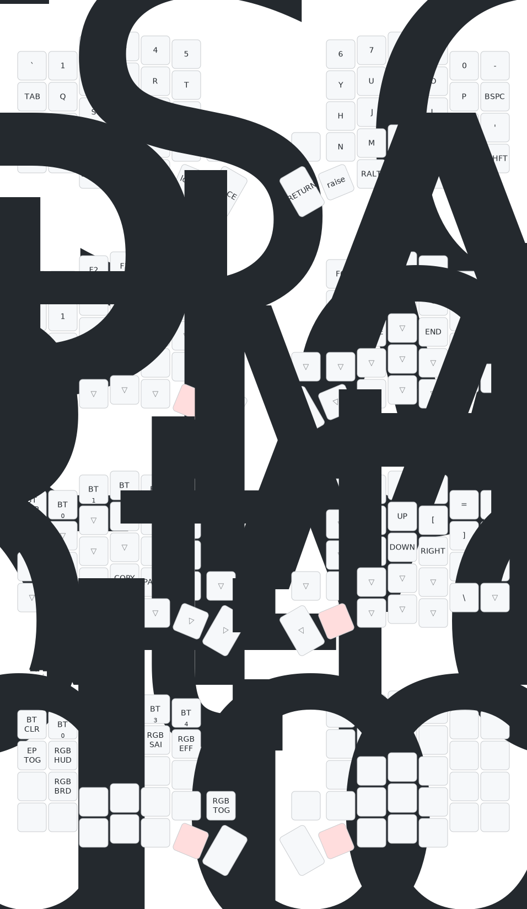

# Sofle V2 RGB with Dongle - ZMK Configuration

This repository contains the ZMK configuration for the **Sofle V2 RGB** keyboard (from [PandaKB](https://pandakb.com/shop/pcb-kit/sofle-rgb-mx-pcb-kit/) and other retailers on [Aliexpress](https://pt.aliexpress.com/item/1005008453765735.html?spm=a2g0o.productlist.main.28.51d258f3zYx3az&algo_pvid=5fabc906-92a4-4cfd-ba2b-5b5ee188cf3a&algo_exp_id=5fabc906-92a4-4cfd-ba2b-5b5ee188cf3a-20&pdp_ext_f=%7B%22order%22%3A%2262%22%2C%22eval%22%3A%221%22%2C%22fromPage%22%3A%22search%22%7D&pdp_npi=6%40dis%21BRL%2163.59%2163.59%21%21%2178.05%2178.05%21%402103119c17626104784947192eedd1%2112000045206137354%21sea%21BR%21772644390%21X%211%210%21n_tag%3A-29919%3Bd%3A29271214%3Bm03_new_user%3A-29895&curPageLogUid=lTHowaaUWN6k&utparam-url=scene%3Asearch%7Cquery_from%3A%7Cx_object_id%3A1005008453765735%7C_p_origin_prod%3A) too) with support for a **central dongle** for BLE communication.

## 📋 About the Project

This configuration is based on the **Sofle V2 RGB** keyboard, a 6×4+5 key split ergonomic keyboard with:
- **Microcontrollers**: Nice!Nano v2 (on left/right sides)
- **Central Dongle**: Nice!Nano v2 with SH1106 display (129x64) for BLE coordination
- **Display**: OLED SH1106 on the central dongle
- **RGB Underglow**: WS2812 LEDs (36 LEDs per side, per-key RGB with underglow support)
- **Encoders**: EC11 rotary encoders on both sides

The RGB configuration is based on [zmk-for-keyboards](https://github.com/zmk-for-keyboards/zmk-for-keyboards) and uses GPIO 0.6 (SPI3 MOSI) for LED data communication.

The central dongle is similar to the one available on [AliExpress](https://pt.aliexpress.com/item/1005009001752841.html) and allows the keyboard to function as a BLE central device, connecting to both sides (left/right) via Bluetooth.

## 🎹 Default Keymap

The default keymap of this keyboard can be visualized here:


## 🔧 Required Hardware

- **2x Nice!Nano v2** (for left/right sides)
- **1x Nice!Nano v2** (for central dongle)
- **1x OLED SH1106 129x64 display** (for dongle)
- **Sofle V2 RGB PCB** (from PandaKB)

## 📦 Build and Flashing

### Running the Workflow

This repository uses GitHub Actions to compile the ZMK firmware. The workflow is triggered automatically on:
- Push to the repository
- Pull requests
- Manually via `workflow_dispatch`

To trigger manually:
1. Go to the **Actions** tab in your repository
2. Select the **Build** workflow
3. Click **Run workflow**

### Workflow Artifacts

After the workflow completes, you can download the artifacts from the **Actions** tab. The `.zip` file contains:
- `sofle_dongle_central.uf2` - Firmware for the central dongle
- `sofle_dongle_left.uf2` - Firmware for the left side
- `sofle_dongle_right.uf2` - Firmware for the right side
- `settings_reset.uf2` - Settings reset

### Flashing the Firmware

#### Steps to Ensure Success

- The central dongle and keyboard sides must be flashed **separately**
- The keyboard must be in **bootloader mode** to flash
- To enter bootloader mode, press the **BOOT** button twice quickly
- If you have issues, flash the `settings_reset.uf2` first to reset the state

#### Recommended Flashing Order

1. **Central Dongle** (first):
   - Connect the dongle via USB-C
   - Enter bootloader mode (press BOOT 2x)
   - Drag the `sofle_dongle_central.uf2` file to the USB drive
   - Wait for automatic reboot
   - Disconnect and keep the dongle powered on

2. **Right Side**:
   - Connect the right side via USB-C
   - Enter bootloader mode
   - Drag the `sofle_dongle_right.uf2` file
   - Wait for reboot
   - Disconnect and power on the right side (should connect to dongle via BLE)

3. **Left Side**:
   - Connect the left side via USB-C
   - Enter bootloader mode
   - Drag the `sofle_dongle_left.uf2` file
   - Wait for reboot
   - Disconnect and power on the left side (should connect to dongle via BLE)

4. **Verification**:
   - The dongle display should show connection status
   - Test the keyboard in a text editor

#### Flashing Process

1. Connect the device to your computer via USB-C
2. Press the **BOOT** button twice quickly to enter bootloader mode
3. The device should appear as a USB drive on your computer
4. Drag and drop the corresponding `.uf2` file onto the USB drive
5. The device will automatically reboot and the new firmware will be installed

**Note:** Some operating systems may show a failure when the device reboots, or the USB drive may disappear. This is normal and the device should have been flashed successfully. Flashing has been tested successfully on Windows 10 and Linux.

## 🎨 Modifying the Keymap

### ZMK Documentation

We recommend reviewing the [ZMK Keymap documentation](https://zmk.dev/docs/features/keymaps) to understand the structure of keymap files.

### Online Editor

ZMK provides an [online keymap editor](https://nickcoutsos.github.io/keymap-editor) that you can use to modify the keymap. This repository is already configured for use with this editor.

### Manual Modification

Exact indentation doesn't matter, but keeping indentation consistent makes it easier to read keymap files. See the [default keymap](config/sofle_dongle.keymap) to see how this was done.

## 🔍 Project Structure

```
sofle-v2-oled-zmk/
├── config/
│   ├── boards/shields/sofle_dongle/  # Shield definitions
│   │   ├── sofle_dongle_central.overlay  # Dongle configuration
│   │   ├── sofle_dongle_left.overlay     # Left side configuration
│   │   ├── sofle_dongle_right.overlay    # Right side configuration
│   │   └── ...
│   ├── sofle_dongle.conf                # Global configurations
│   └── sofle_dongle.keymap              # Main keymap
├── build.yaml                           # Build configuration
└── README.md                            # This file
```

## 💡 RGB Underglow

The keyboard features RGB underglow with per-key RGB support:
- **36 WS2812 LEDs per side** (6 underglow + 30 per-key)
- **Auto-off when idle** to save battery
- **SPI-based control** via GPIO 0.6

### Controlling RGB

RGB underglow can be controlled via keymap behaviors. Common controls include:
- Toggle on/off
- Brightness adjustment
- Effect selection (rainbow, solid, breathing, etc.)
- Hue/color adjustment

See the [ZMK RGB Underglow documentation](https://zmk.dev/docs/features/underglow) for more details on configuring RGB behaviors in your keymap.

## 🐛 Troubleshooting

### Display not working
- Verify the display is SH1106 (129x64), not SSD1306
- Confirm I2C pins are correct (SDA: GPIO 17, SCL: GPIO 20)

### Sides not connecting to dongle
- Make sure the dongle was flashed first
- Verify both sides are powered on
- Try resetting settings with `settings_reset`

### RGB not working
- Verify the RGB LEDs are properly soldered
- Ensure both left and right sides have RGB enabled in their respective `.conf` files
- RGB will automatically turn off when the keyboard enters idle state (power saving feature)


## 📚 References

- [ZMK Documentation](https://zmk.dev/)
- [ZMK RGB Underglow Guide](https://zmk.dev/docs/features/underglow)
- [Sofle Keyboard](https://github.com/josefadamcik/SofleKeyboard)
- [PandaKB](https://pandakb.com/)
- [Nice!Nano](https://nicekeyboards.com/nice-nano)
- [zmk-for-keyboards](https://github.com/zmk-for-keyboards/zmk-for-keyboards) - RGB configuration reference

## 📝 License

This project is under the MIT license, based on the work of the ZMK project and the Sofle community.
